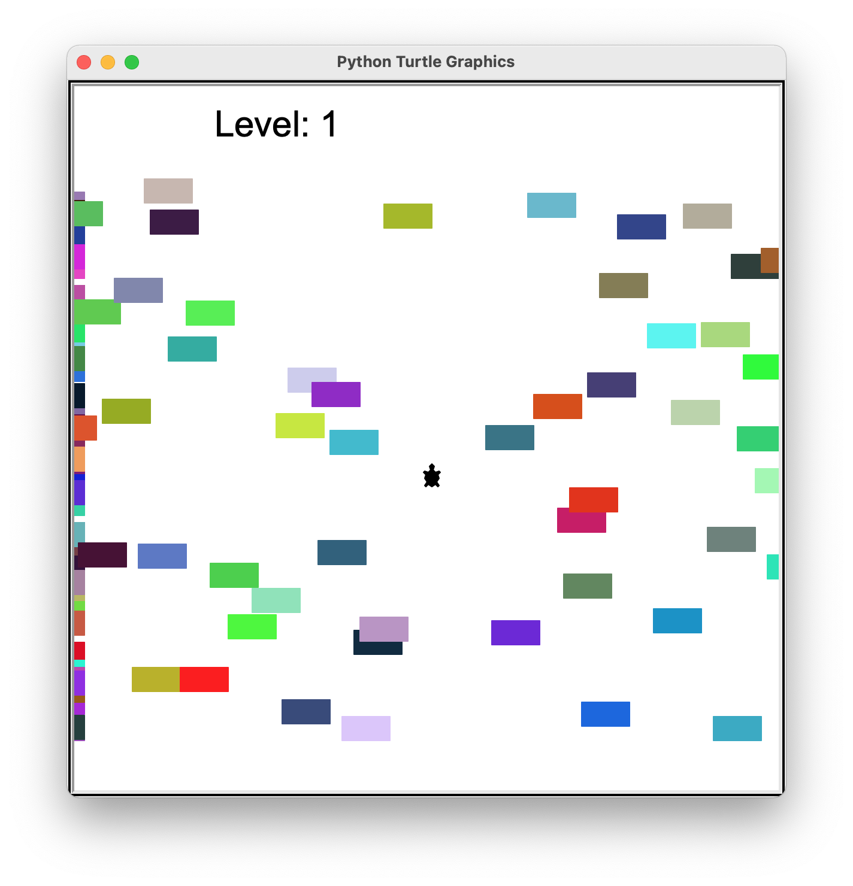

# **Turtle crossing**

### Game was created using the Turtle graphics module

---

### Objectives:

The player is a turtle, whose main objective is to cross busy roadway, where cars are constantly passing by.

- Game ends when car hits player;
- After crossing road till upper edge, player is promoted to another level. In each every higher level, the speed of the cars accelerates;

## Screenshots:

